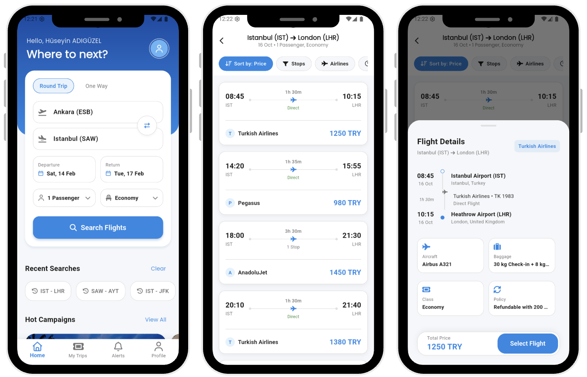
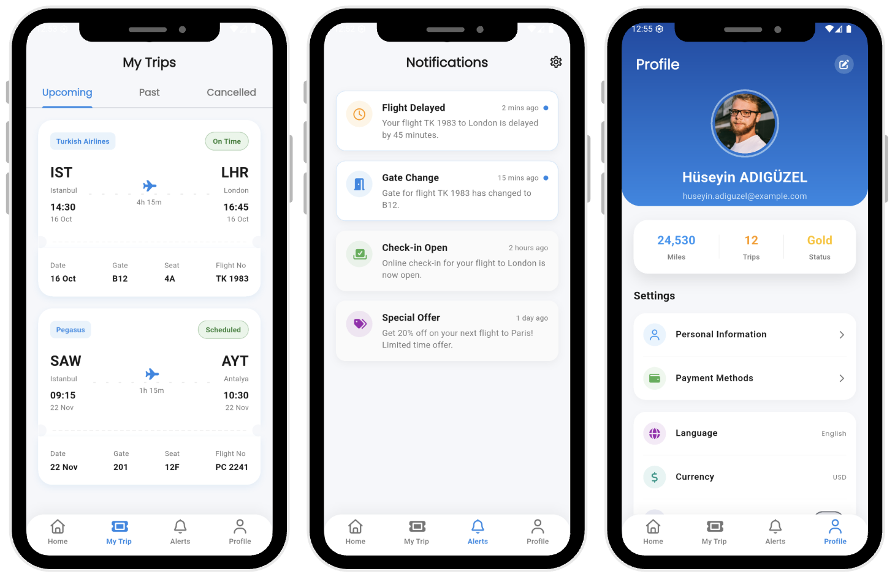

# Fly Ticket 


[English](#english) | [Türkçe](#türkçe)

---

<a name="english"></a>
## 🇬🇧 English

**Fly Ticket** is a modern flight booking application built with Flutter, designed to provide a premium user experience for searching, booking, and managing flights.

The project is built following **Clean Architecture** principles to ensure scalability, testability, and maintainability.

### Screenshots

<p align="center">
  
  
</p>

### Key Features

- **Modern & Premium UI**: A visually stunning interface with glassmorphism effects, smooth gradients, and custom micro-animations.
- **Flight Search**: Advanced search functionality with date pickers and route selection.
- **My Trips**: Manage upcoming, past, and cancelled flights with a detailed ticket view.
- **Notifications**: Real-time updates for flight delays, gate changes, and check-in alerts.
- **Profile Management**: customizable profile settings, dark mode support, and membership status tracking.
- **Custom Navigation**: A unique, custom-designed bottom navigation bar.

### Architecture

This project strictly follows **Clean Architecture** combined with **Feature-First** packaging.

- **Presentation Layer**: Contains UI components (Widgets, Pages) and State Management (Bloc/Cubit or Provider).
- **Domain Layer**: The core business logic. It contains Entities, Use Cases, and Repository Interfaces. It is completely independent of external libraries.
- **Data Layer**: Handles data retrieval. It contains Repository Implementations, Data Sources (API, Local DB), and Models.

```
lib/
  ├── core/                 # Shared utilities, theme, constants
  ├── features/
  │   ├── home/            # Home feature (Presentation, Domain, Data)
  │   ├── trips/           # My Trips feature
  │   ├── profile/         # User Profile feature
  │   └── notifications/   # Notifications feature
  └── main.dart            # Application entry point
```

### Getting Started

1.  **Clone the repository**:
    ```bash
    git clone https://github.com/hsynadguzel/fly-ticket.git
    cd fly-ticket
    ```

2.  **Install dependencies**:
    ```bash
    flutter pub get
    ```

3.  **Run the app**:
    ```bash
    flutter run
    ```

---

<a name="türkçe"></a>
## 🇹🇷 Türkçe

**Fly Ticket**, uçuş arama, rezervasyon ve seyahat yönetimi için premium bir kullanıcı deneyimi sunmak üzere tasarlanmış, Flutter ile geliştirilmiş modern bir uçak bileti uygulamasıdır.

Proje, ölçeklenebilirlik, test edilebilirlik ve sürdürülebilirlik sağlamak için **Clean Architecture** (Temiz Mimari) prensiplerine uygun olarak geliştirilmiştir.

### Ekran Görüntüleri

<p align="center">
  
  
</p>

### ✨ Temel Özellikler

- **Modern & Premium Arayüz**: Glassmorphism efektleri, yumuşak gradyanlar ve özel mikro animasyonlarla görsel olarak büyüleyici bir arayüz.
- **Uçuş Arama**: Tarih seçimi ve rota belirleme ile gelişmiş arama işlevselliği.
- **Seyahatlerim**: Gelecek, geçmiş ve iptal edilen uçuşları detaylı bilet görünümü ile yönetme.
- **Bildirimler**: Uçuş gecikmeleri, kapı değişiklikleri ve check-in uyarıları için anlık bildirimler.
- **Profil Yönetimi**: Özelleştirilebilir profil ayarları, karanlık mod desteği ve üyelik durumu takibi.
- **Özel Navigasyon**: Benzersiz, özel tasarlanmış alt navigasyon çubuğu.

### Mimari

Bu proje, **Feature-First** (Özellik Öncelikli) paketleme yapısı ile birleştirilmiş **Clean Architecture** prensiplerini sıkı bir şekilde takip eder.

- **Presentation (Sunum) Katmanı**: UI bileşenlerini (Widget'lar, Sayfalar) ve Durum Yönetimini içerir.
- **Domain (Alan) Katmanı**: Temel iş mantığını içerir. Varlıklar (Entities), Kullanım Durumları (Use Cases) ve Depo Arayüzleri (Repository Interfaces) burada bulunur. Dış kütüphanelerden tamamen bağımsızdır.
- **Data (Veri) Katmanı**: Veri erişimini yönetir. Depo Uygulamaları (Repository Implementations), Veri Kaynakları (API, Yerel DB) ve Modelleri içerir.

```
lib/
  ├── core/                 # Paylaşılan araçlar, tema, sabitler
  ├── features/
  │   ├── home/            # Ana sayfa özelliği (Sunum, Alan, Veri)
  │   ├── trips/           # Seyahatlerim özelliği
  │   ├── profile/         # Kullanıcı Profili özelliği
  │   └── notifications/   # Bildirimler özelliği
  └── main.dart            # Uygulama giriş noktası
```

### Başlarken

1.  **Depoyu klonlayın**:
    ```bash
    git clone https://github.com/hsynadguzel/fly-ticket.git
    cd fly-ticket
    ```

2.  **Bağımlılıkları yükleyin**:
    ```bash
    flutter pub get
    ```

3.  **Uygulamayı çalıştırın**:
    ```bash
    flutter run
    ```

---

<p align="center">
  Developed with ❤️ by <a href="https://github.com/hsynadguzel">Hüseyin ADIGÜZEL</a>
</p>
